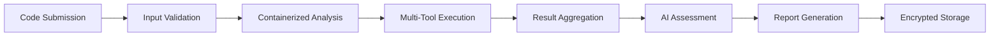

# Security Policy

**OpenAuditLabs Agent Repository**  
Last Updated: July 2025

---

## Table of Contents

1. [Security Overview](#security-overview)
2. [Reporting Security Vulnerabilities](#reporting-security-vulnerabilities)
3. [Security Architecture](#security-architecture)
4. [AI Agent Security Framework](#ai-agent-security-framework)
5. [Audit Process Security](#audit-process-security)
6. [Container & Infrastructure Security](#container--infrastructure-security)
7. [Data Protection & Privacy](#data-protection--privacy)
8. [Security Guidelines for Contributors](#security-guidelines-for-contributors)
9. [Incident Response](#incident-response)
10. [Compliance & Standards](#compliance--standards)

---

## Security Overview

OpenAuditLabs Agent is a sophisticated AI-powered smart contract auditing platform that leverages CrewAI, Slither, Mythril, and other security tools. Given the critical nature of smart contract security and the autonomous capabilities of AI agents, maintaining robust security practices is paramount to protecting both our system and our users' assets.

### Core Security Principles

- **Defense in Depth**: Multi-layered security approach across all system components
- **Zero Trust Architecture**: Verify every interaction, never assume trust
- **Least Privilege**: Minimal necessary permissions for all components
- **Transparency**: Open security practices and clear audit trails
- **Continuous Monitoring**: Real-time threat detection and response

---

## Reporting Security Vulnerabilities

### Vulnerability Disclosure Policy

We take security vulnerabilities seriously and appreciate responsible disclosure from the security research community.

#### How to Report

**🚨 DO NOT report security vulnerabilities through public GitHub issues, discussions, or pull requests.**

Instead, please email security vulnerabilities to:
**security@openauditlabs.com**

#### Required Information

To help us validate and remediate issues quickly, please include:

- **Vulnerability Type**: Clear classification (e.g., privilege escalation, injection, authentication bypass)
- **Affected Components**: Specific file paths, endpoints, or system components
- **Reproduction Steps**: Detailed step-by-step instructions with screenshots
- **Environment Details**: Docker versions, OS, configuration requirements
- **Proof of Concept**: Exploit code or demonstration (if available)
- **Impact Assessment**: Potential consequences and attack scenarios
- **Suggested Remediation**: Recommended fixes or mitigations

#### Our Response Process

1. **Acknowledgment**: We will confirm receipt within 24 hours
2. **Initial Assessment**: Vulnerability triage within 72 hours
3. **Validation**: Reproduction and impact verification within 5 business days
4. **Remediation**: Patch development and testing
5. **Disclosure**: Coordinated public disclosure after fix deployment

#### Safe Harbor

If you make a good faith effort to comply with this policy during your security research, we will:

- Consider your research authorized
- Work with you to understand and resolve the issue quickly
- Not pursue legal action related to your research
- Recognize your contribution (with your permission)

#### Scope

**In Scope:**
- All components in the OpenAuditLabs/agent repository
- Docker containers and orchestration
- API endpoints and authentication mechanisms
- AI agent interactions and tool integrations
- Database and data processing components

**Out of Scope:**
- Social engineering attacks
- Physical attacks on infrastructure
- Third-party services and dependencies
- DDoS attacks

---

## Security Architecture

### System Components

```
┌─────────────────┐    ┌──────────────────┐    ┌─────────────────┐
│   Web Client    │    │   API Gateway    │    │  AI Orchestrator│
│  (React/Next)   │◄──►│   (FastAPI)      │◄──►│    (CrewAI)     │
└─────────────────┘    └──────────────────┘    └─────────────────┘
                                │                        │
                                ▼                        ▼
                    ┌──────────────────┐    ┌─────────────────┐
                    │   PostgreSQL     │    │   Audit Tools   │
                    │   (Encrypted)    │    │ (Slither/Mythril)│
                    └──────────────────┘    └─────────────────┘
```

### Security Boundaries

1. **External Boundary**: WAF, rate limiting, DDoS protection
2. **API Boundary**: Authentication, authorization, input validation
3. **Agent Boundary**: Sandboxed execution, resource limits
4. **Data Boundary**: Encryption, access controls, audit logging
5. **Tool Boundary**: Isolated execution environments

---

## AI Agent Security Framework

### Agent Authorization & Authentication

All AI agents operate within a secure authentication framework:

```yaml
Agent Security Model:
  - Identity: Unique agent identifiers with cryptographic signatures
  - Authorization: Role-based access control (RBAC) with minimal privileges
  - Session Management: Time-bound tokens with automatic rotation
  - Tool Access: Explicit permission grants for external tool usage
```

### Agent Behavior Monitoring

- **Action Logging**: All agent decisions and tool invocations logged
- **Anomaly Detection**: Behavioral pattern analysis for suspicious activity
- **Resource Monitoring**: CPU, memory, and network usage tracking
- **Output Validation**: AI-generated content scanning and filtering

### Prompt Injection Prevention

Following OWASP AI security guidelines:

- **Input Sanitization**: Strict validation of all user inputs
- **Context Isolation**: Separation of user data from system prompts
- **Output Filtering**: Content scanning for malicious instructions
- **Privilege Boundaries**: Agent capabilities strictly limited

### Tool Integration Security

- **Sandboxed Execution**: All security tools run in isolated containers
- **Command Validation**: Whitelist approach for tool parameters
- **Result Verification**: Output validation before processing
- **Access Controls**: Fine-grained permissions for tool access

---

## Audit Process Security

### Secure Audit Pipeline



### Code Handling Security

- **Isolation**: Each audit runs in a separate container environment
- **Resource Limits**: CPU, memory, and time constraints
- **Network Segmentation**: No external network access during analysis
- **Data Sanitization**: Automatic cleanup after audit completion

### Audit Tool Security

**Slither Security:**
- Updated vulnerability signatures
- Sandboxed execution environment
- Output sanitization and validation

**Mythril Security:**
- Isolated symbolic execution
- Resource consumption monitoring
- Secure result parsing

**Custom Tools:**
- Code review for all custom integrations
- Security testing before deployment
- Regular security updates

### Report Integrity

- **Digital Signatures**: All reports cryptographically signed
- **Immutable Storage**: Blockchain-based audit trail
- **Access Logging**: Complete chain of custody tracking
- **Version Control**: Tamper-evident report versioning

---

## Container & Infrastructure Security

### Docker Security

Following Docker security best practices:

```dockerfile
# Security-hardened base images
FROM debian:12-slim as base
RUN apt-get update && apt-get upgrade -y

# Non-root user execution
RUN groupadd -r appuser && useradd -r -g appuser appuser
USER appuser

# Resource limits and security options
SECURITY_OPT: ["no-new-privileges:true"]
CAP_DROP: ["ALL"]
CAP_ADD: ["CHOWN", "SETGID", "SETUID"]
```

### Container Scanning

- **Vulnerability Scanning**: Trivy and Clair integration
- **Base Image Updates**: Automated security patches
- **Configuration Hardening**: CIS Docker Benchmark compliance
- **Runtime Security**: Falco monitoring for suspicious activity

### Infrastructure Security

**Network Security:**
- VPC isolation with private subnets
- WAF protection for public endpoints
- Service mesh for internal communication
- Network segmentation between components

**Secrets Management:**
- HashiCorp Vault integration
- Encrypted environment variables
- Automatic secret rotation
- No secrets in container images

**Monitoring & Logging:**
- Centralized logging with ELK stack
- Security event correlation
- Real-time alerting system
- Compliance audit trails

---

## Data Protection & Privacy

### Data Classification

| Classification | Description | Security Measures |
|---------------|-------------|-------------------|
| **Public** | Marketing content, documentation | Standard web security |
| **Internal** | System logs, performance metrics | Access controls, encryption in transit |
| **Confidential** | User contracts, audit reports | Encryption at rest/transit, access logging |
| **Restricted** | Private keys, secrets | Hardware security modules, strict access |

### Encryption Standards

- **In Transit**: TLS 1.3 for all communications
- **At Rest**: AES-256 encryption for sensitive data
- **Key Management**: Hardware security modules (HSM)
- **Database**: Transparent data encryption (TDE)

### Privacy Protection

- **Data Minimization**: Collect only necessary information
- **Purpose Limitation**: Data used only for stated purposes
- **Retention Policies**: Automatic data purging schedules
- **User Rights**: Data access, correction, and deletion capabilities

---

## Security Guidelines for Contributors

### Secure Development Practices

#### Code Security

```python
# Input validation example
def validate_contract_input(contract_code: str) -> bool:
    """Validate smart contract input with strict sanitization."""
    if not contract_code or len(contract_code) > MAX_CONTRACT_SIZE:
        return False
    
    # Check for malicious patterns
    forbidden_patterns = [
        r'eval\s*\(',
        r'exec\s*\(',
        r'import\s+os',
        r'subprocess\.'
    ]
    
    for pattern in forbidden_patterns:
        if re.search(pattern, contract_code):
            return False
    
    return True
```

#### Security Testing Requirements

- **Static Analysis**: Pre-commit hooks with Bandit and Semgrep
- **Dependency Scanning**: Automated vulnerability checks
- **Container Scanning**: Image security validation
- **Integration Tests**: Security-focused test scenarios

#### Pre-commit Security Hooks

```yaml
# .pre-commit-config.yaml security hooks
repos:
  - repo: https://github.com/PyCQA/bandit
    rev: 1.7.5
    hooks:
      - id: bandit
        args: ['-r', 'src/']
  
  - repo: https://github.com/hadolint/hadolint
    rev: v2.12.0
    hooks:
      - id: hadolint-docker
```

### Secret Management

**Never commit secrets to version control:**

```bash
# Use environment variables
POSTGRES_PASSWORD=${POSTGRES_PASSWORD}
REDIS_URL=${REDIS_URL}
API_SECRET_KEY=${API_SECRET_KEY}

# Use .env files (git ignored)
echo "*.env" >> .gitignore
echo "secrets/" >> .gitignore
```

### Secure Configuration

**Database Configuration:**
```python
DATABASE_CONFIG = {
    'encrypt': True,
    'ssl_mode': 'require',
    'connection_timeout': 30,
    'max_connections': 100,
    'pool_pre_ping': True
}
```

**API Security Configuration:**
```python
SECURITY_CONFIG = {
    'rate_limit': '100/minute',
    'jwt_secret_key': os.getenv('JWT_SECRET_KEY'),
    'session_timeout': 3600,
    'password_hash_rounds': 12
}
```

---

## Incident Response

### Security Incident Classification

| Severity | Definition | Response Time | Escalation |
|----------|------------|---------------|------------|
| **Critical** | Active exploitation, data breach | < 1 hour | Executive team |
| **High** | Vulnerability with high impact | < 4 hours | Security team lead |
| **Medium** | Potential security weakness | < 24 hours | Development team |
| **Low** | Minor security concern | < 72 hours | Maintainer review |

### Response Procedures

#### Immediate Response (First 1-4 hours)
1. **Contain**: Isolate affected systems
2. **Assess**: Determine scope and impact
3. **Communicate**: Notify stakeholders
4. **Document**: Begin incident log

#### Investigation Phase (First 24-48 hours)
1. **Evidence Collection**: Preserve logs and artifacts
2. **Root Cause Analysis**: Identify vulnerability source
3. **Impact Assessment**: Determine data/system compromise
4. **Patch Development**: Begin remediation work

#### Recovery Phase (48+ hours)
1. **Patch Deployment**: Apply security fixes
2. **System Restoration**: Return to normal operations
3. **Monitoring**: Enhanced surveillance post-incident
4. **Post-Incident Review**: Lessons learned documentation

### Emergency Contacts

- **Security Team Lead**: security-lead@openauditlabs.com
- **Technical Lead**: tech-lead@openauditlabs.com
- **Executive Team**: exec@openauditlabs.com
- **24/7 Hotline**: +1-XXX-XXX-XXXX

---

## Compliance & Standards

### Security Frameworks

We align with industry-standard security frameworks:

- **NIST Cybersecurity Framework**: Core security practices
- **OWASP AI Security Guidelines**: AI-specific security measures
- **ISO 27001**: Information security management
- **SOC 2 Type II**: Service organization controls

### Smart Contract Security Standards

- **ConsenSys Diligence**: Audit methodology alignment
- **Trail of Bits**: Security assessment practices
- **OpenZeppelin**: Secure development patterns
- **OWASP Smart Contract Security**: Best practices adoption

### Regular Security Assessments

- **Quarterly**: Internal security reviews
- **Bi-annually**: Third-party penetration testing
- **Annually**: Comprehensive security audits
- **Continuous**: Automated vulnerability scanning

### Audit Trail Requirements

All security-relevant events must be logged with:
- Timestamp (UTC)
- Actor identification
- Action performed
- Resource affected
- Result/outcome
- Source IP address

---

## Security Contact Information

For security-related inquiries and reports:

- **Primary**: security@openauditlabs.com
- **PGP Key**: [Available on request]
- **Response Time**: 24-48 hours
- **Escalation**: exec@openauditlabs.com

---

## Acknowledgments

We thank the security research community for their contributions to making OpenAuditLabs Agent more secure. Responsible disclosure helps protect our users and the broader smart contract ecosystem.

### Hall of Fame
*Contributors who have responsibly disclosed vulnerabilities will be listed here with their permission.*

---

**Note**: This security policy is reviewed and updated regularly. Please check back for the latest version. Last updated: January 2025.

---

*This document is licensed under the same terms as the OpenAuditLabs/agent repository.*
